# AJS Redzone Portal — Admin User Manual

**For:** AJS Admin & Manager staff  
**Portal:** https://redzone.ajsspalding.co.uk/admin  
**Last updated:** June 2026

---

## Contents

1. [Logging In](#1-logging-in)
2. [Navigation Overview](#2-navigation-overview)
3. [Orders](#3-orders)
   - 3.1 [Orders List](#31-orders-list)
   - 3.2 [Viewing an Order](#32-viewing-an-order)
   - 3.3 [Updating Order Status](#33-updating-order-status)
   - 3.4 [Editing Quote Items & Pricing](#34-editing-quote-items--pricing)
   - 3.5 [Assigning a Redzone PM](#35-assigning-a-redzone-pm)
   - 3.6 [Win Probability](#36-win-probability)
   - 3.7 [Internal Notes](#37-internal-notes)
4. [CRM — Leads](#4-crm--leads)
   - 4.1 [Leads List & Stages](#41-leads-list--stages)
   - 4.2 [Adding a Lead](#42-adding-a-lead)
   - 4.3 [Contacts](#43-contacts)
5. [Installation Quotes](#5-installation-quotes)
6. [Products](#6-products)
   - 6.1 [Products List](#61-products-list)
   - 6.2 [Adding a Product](#62-adding-a-product)
   - 6.3 [Editing a Product](#63-editing-a-product)
   - 6.4 [Activating & Deactivating Products](#64-activating--deactivating-products)
7. [Product Pipeline](#7-product-pipeline)
8. [User Management](#8-user-management)
   - 8.1 [AJS Staff Users](#81-ajs-staff-users)
   - 8.2 [Redzone Portal Users](#82-redzone-portal-users)
   - 8.3 [Resetting a Password](#83-resetting-a-password)
9. [Settings](#9-settings)
10. [Email Flows — What Goes Out Automatically](#10-email-flows--what-goes-out-automatically)

---

## 1. Logging In

Navigate to **https://redzone.ajsspalding.co.uk/admin/login**

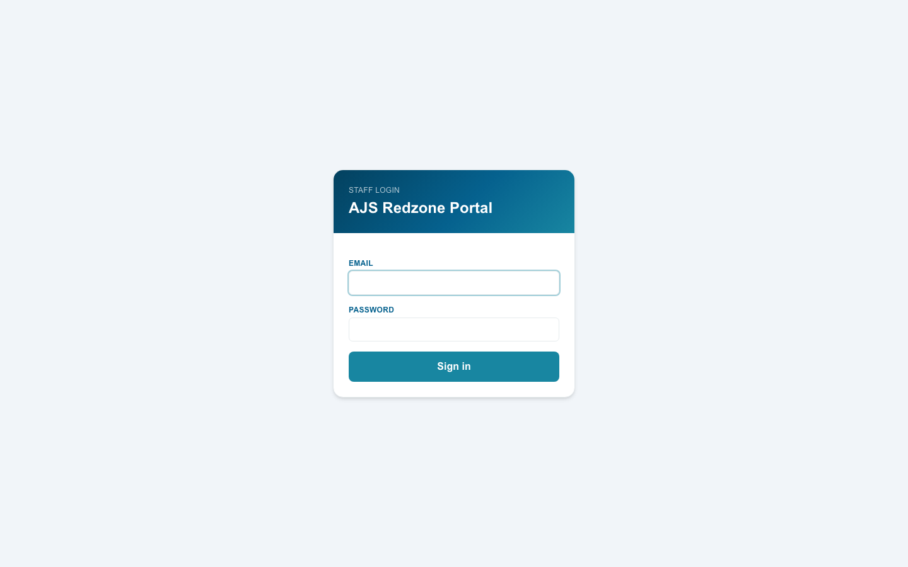

Enter your AJS email address and password, then click **Sign in**.

> **Forgotten your password?** Contact another admin user — they can generate you a secure reset link from the Users page (no email required, no rate limits). See [section 8.3](#83-resetting-a-password).

Once signed in you will land on the Orders list. Your email address is shown in the top-right corner at all times.

---

## 2. Navigation Overview

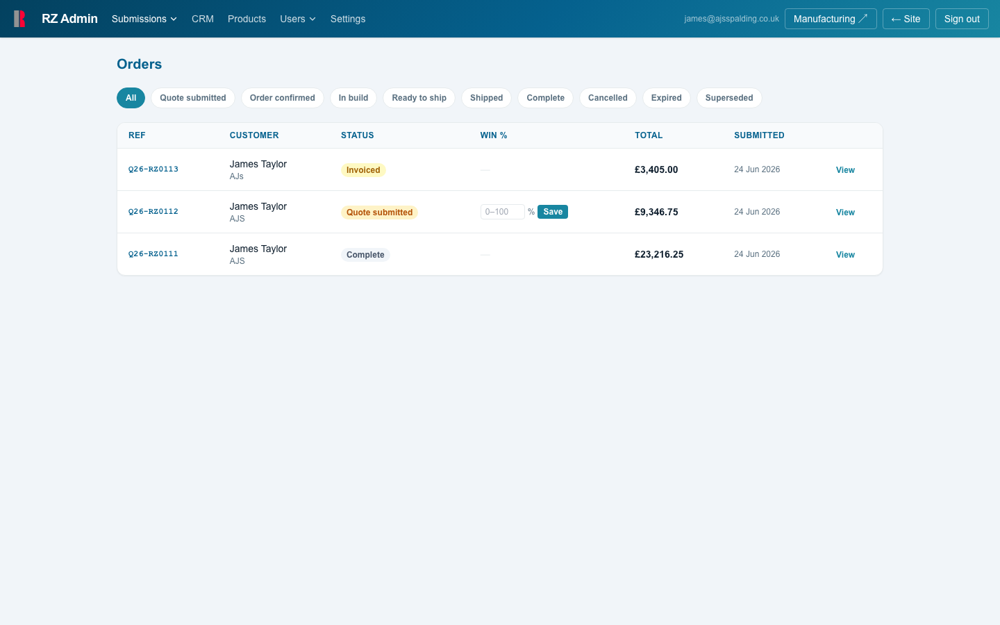

The dark teal navigation bar runs across the top of every admin page:

| Nav item | What it opens |
|---|---|
| **Submissions** | Dropdown: Orders / Installation Quotes |
| **CRM** | Leads pipeline and contacts |
| **Products** | Product catalogue management |
| **Users** | Dropdown: AJS Users / Redzone Users |
| **Settings** | Portal-wide settings |
| **Manufacturing ↗** | Opens the workshop portal in a new tab |
| **← Site** | Returns to the customer-facing catalogue |
| **Sign out** | Logs you out |

---

## 3. Orders

### 3.1 Orders List

**Submissions → Orders**


This is the main working view for the team. Every quote submitted through the portal appears here, newest first.

**Columns**

| Column | Description |
|---|---|
| **Ref** | Unique quote reference (e.g. Q26-RZ0111). Click to open the order. |
| **Customer** | Customer name and company |
| **Status** | Current stage — colour-coded (see below) |
| **Win %** | For open quotes only — your estimated probability of winning |
| **Total** | Ex-VAT total (subtotal + shipping) |
| **Submitted** | Date the quote was received |

**Status colours**

| Colour | Status |
|---|---|
| Amber | Quote submitted |
| Blue | Order confirmed |
| Purple | In build |
| Yellow | Invoiced |
| Green (light) | Payment received |
| Teal | Ready to ship |
| Green | Shipped |
| Grey | Complete / Cancelled / Expired |

**Filtering by status**

Click any filter button along the top (**Quote submitted**, **Order confirmed**, **In build**, etc.) to narrow the list to that stage. Click **All** to reset.

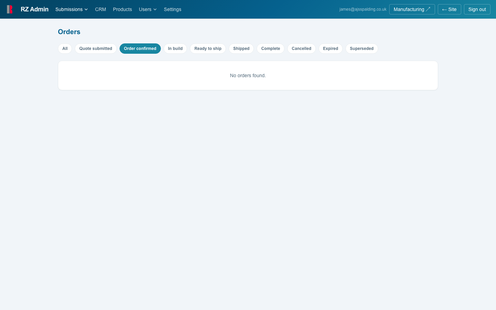

---

### 3.2 Viewing an Order

Click **View** on any row, or click directly on the reference number.

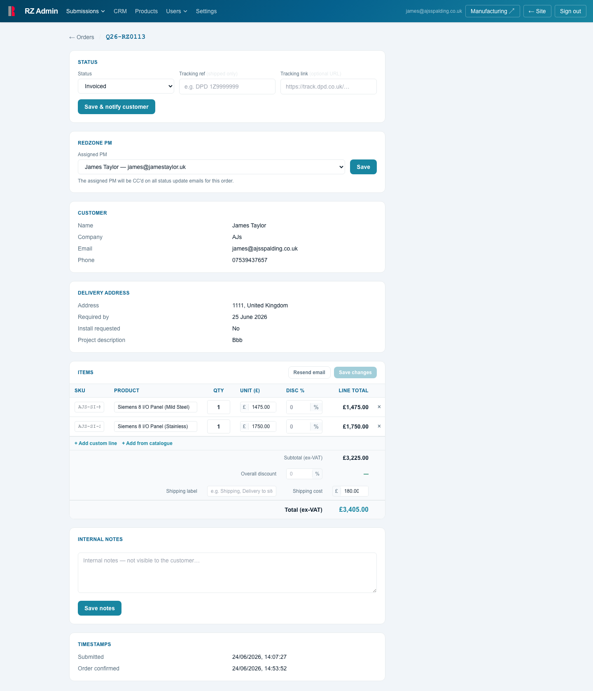

The order detail page is divided into sections:

- **Status** — change the order stage and notify the customer
- **Redzone PM** — assign a Redzone project manager to this order
- **Customer** — contact details as submitted
- **Delivery address** — site address, required-by date, install request, project description
- **Items** — editable line items, pricing, discounts and shipping
- **Internal notes** — private notes, never sent to the customer
- **Timestamps** — full audit trail of when each stage was reached

Use **← Orders** in the top-left to return to the list.

---

### 3.3 Updating Order Status

The **Status** card sits at the top of every order.


1. Select the new status from the dropdown.
2. For **Shipped** — enter the carrier tracking reference and tracking URL (optional but recommended).
3. For **Cancelled** — you will be prompted for a cancellation reason.
4. Click **Save & notify customer**.

The customer receives an automated email immediately. The assigned Redzone PM (if any) receives a separate internal notification at the same time.

**Status flow**

```
Quote submitted → Order confirmed → In build → Invoiced → Payment received
→ Ready to ship → Shipped → Complete
```

You can also mark an order as **Cancelled** or **Expired** at any point.

> **Expiring a quote:** Only quotes in *Quote submitted* status can be expired. This marks them as dead without confirming the order.

---

### 3.4 Editing Quote Items & Pricing

The **Items** section of the order detail page is fully editable — useful for adjusting prices after negotiation, adding items, or applying discounts before re-sending to the customer.


**Changing a line item**

- Edit **Qty**, **Unit price (£)**, or **Disc %** directly in the table.
- The line total updates automatically on save.

**Adding items**

- **+ Add from catalogue** — pick any active product; price pre-fills from the catalogue.
- **+ Add custom line** — enter a free-text SKU, name, and price for one-off items.

**Removing an item**

Click the **×** at the right of any line.

**Overall discount**

Enter a percentage in the **Overall discount** field to apply a blanket reduction across all lines (shown separately on the customer's quote).

**Shipping**

- Enter a shipping cost in pence (e.g. `18000` = £180.00) and a shipping label (e.g. "Shipping — DPD").
- Leave blank if shipping is EXW (customer collects / arranges own freight).

**Saving vs. re-sending**

- **Save changes** — saves the edited items to the database. No email is sent.
- **Resend email** — increments the revision number and sends the customer a fresh quote email (with PDF attachment). Use this after finalising any price changes.

> The revision counter only increases when you click **Resend email**, not on every save.

---

### 3.5 Assigning a Redzone PM

The **Redzone PM** card appears on every order regardless of status.

Select the PM or Manager from the dropdown and click **Save**.

Once assigned:
- The PM can see this order in their Redzone portal
- The PM receives an internal notification email whenever the order status changes

To unassign, select **— Unassigned —** and save.

---

### 3.6 Win Probability

For orders in **Quote submitted** status, a win probability field appears in the Orders list inline (no need to open the order).

Type a number between 0 and 100 and click **Save**. This feeds into forecasting.

---

### 3.7 Internal Notes

The **Internal Notes** text area at the bottom of each order is private — it is never sent to the customer or the Redzone PM. Use it for anything useful: supplier notes, call logs, special requirements.

Click **Save notes** to store.

---

## 4. CRM — Leads

**CRM** in the navigation

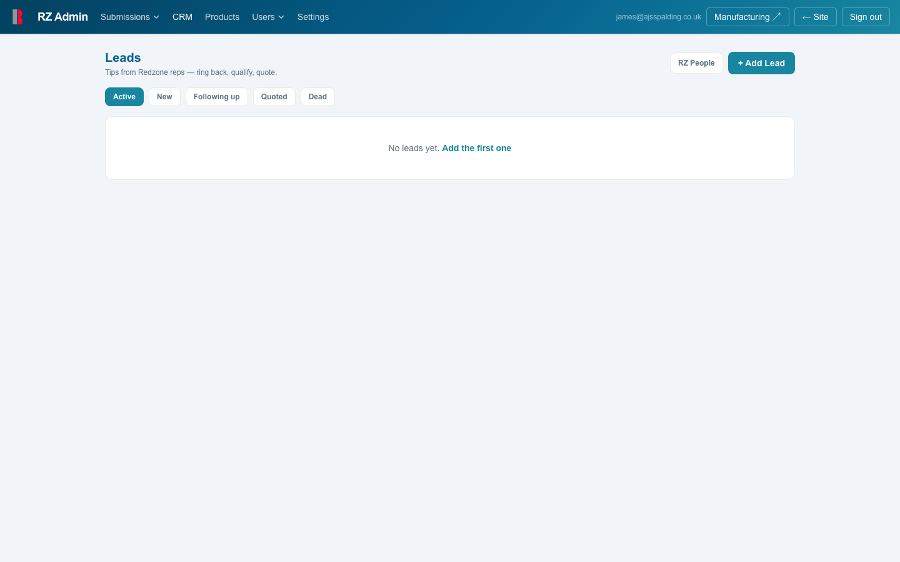

The CRM is a lightweight pipeline for tracking inbound leads from Redzone reps before they become formal quotes. The strapline says it all: *Tips from Redzone reps — ring back, qualify, quote.*

### 4.1 Leads List & Stages

Leads are filtered by stage using the buttons along the top:

| Stage | Meaning |
|---|---|
| **New** | Just received — needs a call back |
| **Following up** | In conversation |
| **Quoted** | A formal quote has been sent via the portal |
| **Dead** | Lost or no longer active |

The default view shows **Active** (New + Following up + Quoted combined).

### 4.2 Adding a Lead

Click **+ Add Lead** in the top-right corner. Fill in the contact details, company, opportunity notes, and assign to a Redzone rep if known.

Once a lead converts to a real quote, change its stage to **Quoted** and link the quote reference.

### 4.3 Contacts

Click **RZ People** to view the contacts directory — all companies and individuals encountered through Redzone activity. Contacts can be created independently of leads and are linked automatically when a quote is submitted by a known email address.

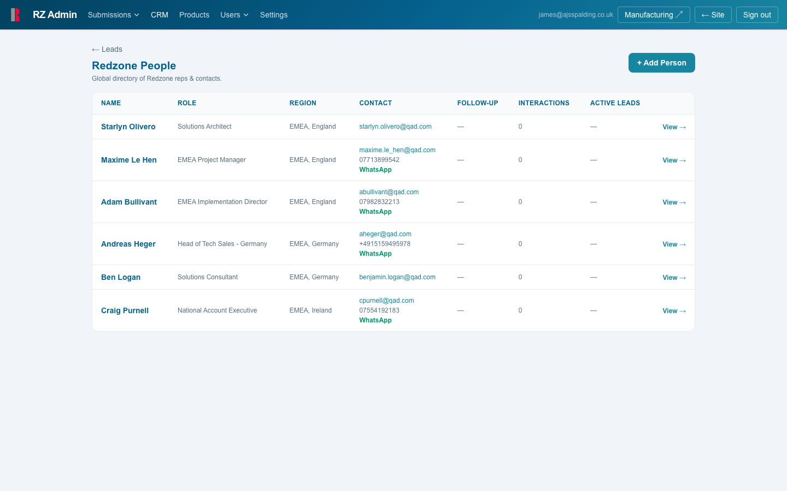

---

## 5. Installation Quotes

**Submissions → Installation Quotes**

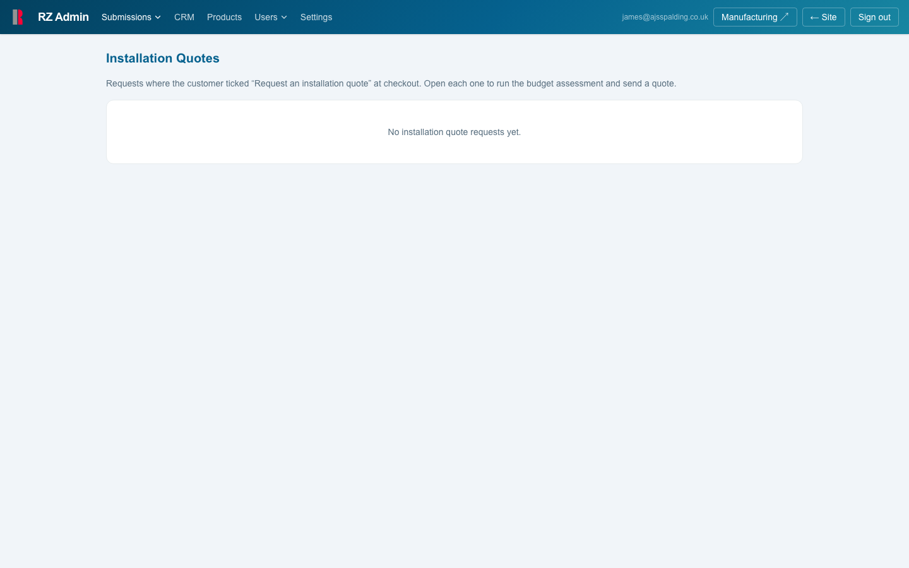

When a customer ticks *Request an installation quote* during checkout, their request appears here. Open each one to:

1. Review the answers to the installation questionnaire (site type, cable runs, containment, etc.)
2. Run the budget assessment tool
3. Send a budget estimate email to the customer (branded, with PDF)

Installation quote requests sit separately from hardware orders — they do not appear in the Orders list.

---

## 6. Products

**Products** in the navigation

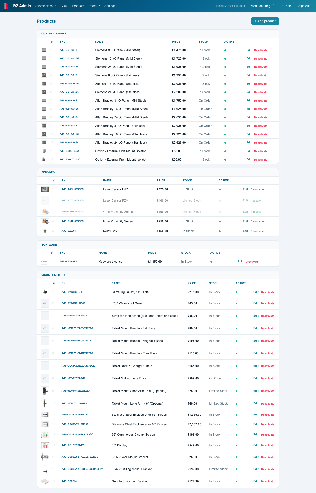

### 6.1 Products List

All products in the catalogue are shown here, grouped by category:

- **Control Panels**
- **Sensors**
- **Software**
- **Visual Factory** (tablets, mounts, accessories)

Each row shows the SKU, product name, price, stock status, and whether the product is **Active** (visible to customers) or inactive (hidden from the catalogue).

### 6.2 Adding a Product

Click **+ Add product** in the top-right corner.

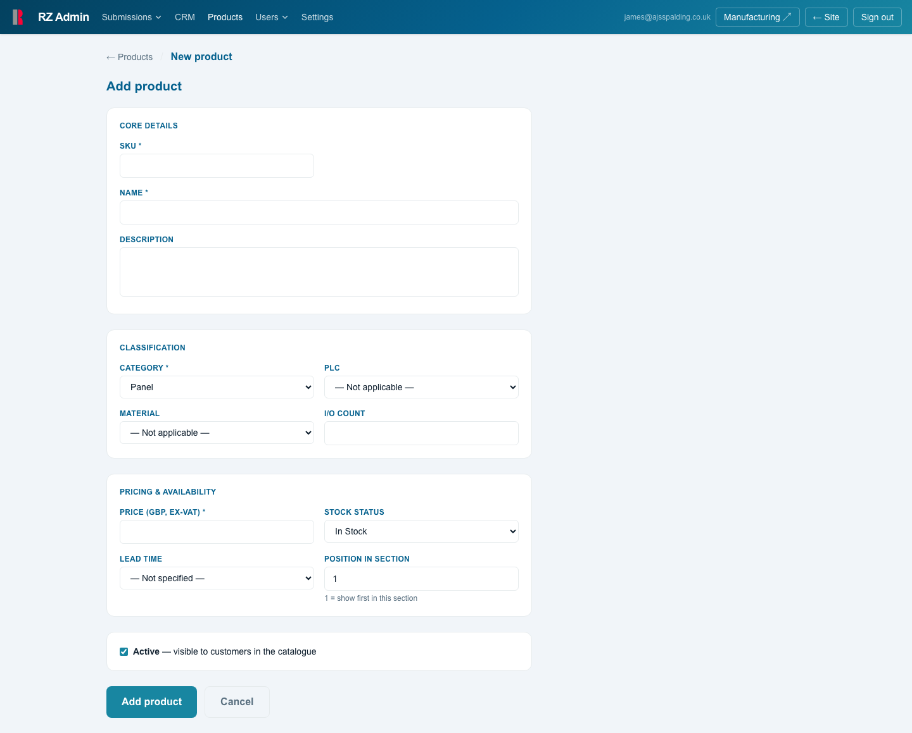

Fill in the required fields:

| Field | Notes |
|---|---|
| **SKU** | Must be unique. Use the AJS naming convention (e.g. AJS-CP-8-MS) |
| **Name** | Displayed to customers on quotes and emails |
| **Category** | Determines which section it appears in on the catalogue |
| **Price (GBP pence)** | Enter in pence — e.g. `147500` for £1,475.00 |
| **Stock status** | Free text — e.g. "In Stock", "4–6 weeks", "Limited Stock" |
| **Lead time** | Free text — e.g. "3–5 days" |
| **Description** | Shown on the product detail page (optional) |
| **Image URL** | Link to the product image (optional) |
| **Active** | Tick to make visible on the customer catalogue immediately |

Click **Save product** to create.

### 6.3 Editing a Product

Click **Edit** on any product row. All fields can be changed. Price changes take effect immediately for new quotes — existing quotes retain their snapshot prices.

### 6.4 Activating & Deactivating Products

Each product has an **Activate** / **Deactivate** button in the Active column:

- **Deactivate** — hides the product from the customer catalogue. Existing quotes containing it are unaffected.
- **Activate** — makes it visible again.

> Products that are deactivated will not appear in the *Add from catalogue* dropdown when editing orders.

---

## 7. Product Pipeline

**Submissions → Pipeline** *(accessible from admin nav)*

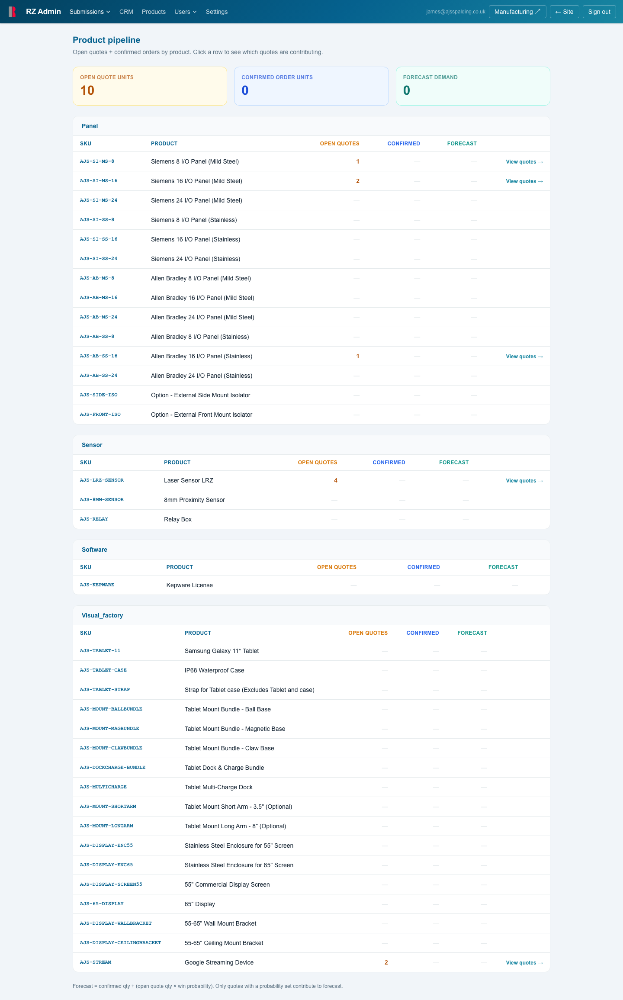

The pipeline gives a real-time view of demand across the product range:

| Column | Meaning |
|---|---|
| **Open quotes** | Products on quotes that are still in *Quote submitted* status |
| **Confirmed orders** | Products on confirmed (live) orders |
| **Forecast demand** | Combined open + confirmed |

Products with activity have a **View quotes →** link to jump directly to the relevant orders.

Use this page to anticipate stock and manufacturing load — particularly useful before placing supplier orders.

---

## 8. User Management

### 8.1 AJS Staff Users

**Users → AJS Users**

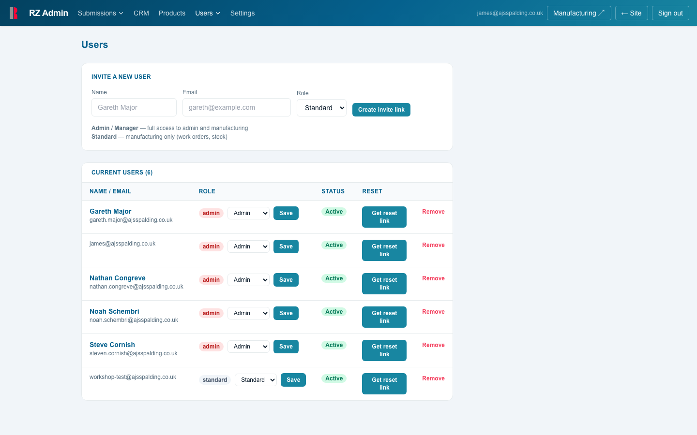

This page manages everyone with access to the admin and manufacturing portals.

**Roles**

| Role | Access |
|---|---|
| **Admin** | Full access — admin portal, manufacturing, all settings |
| **Manager** | Full access — same as Admin |
| **Standard** | Manufacturing only (work orders and stock) — no admin access |

**Inviting a new user**

1. Enter their **Name** and **Email**.
2. Select their **Role**.
3. Click **Create invite link**.
4. A one-time link is generated and copied to your clipboard automatically. Paste it into an email or Teams message to the person. The link expires in 24 hours.
5. When they open the link they set their own password.

> Do not send the raw link via Teams or Outlook — previews can sometimes consume one-time links. Paste it into the body of an email rather than a chat message, or use the copy button and send it directly.

**Changing a user's role**

Use the role dropdown next to their name and click **Save**. Takes effect immediately.

**Removing a user**

Click **Remove**. Access is revoked immediately. This cannot be undone — you would need to re-invite the person if it was a mistake.

---

### 8.2 Redzone Portal Users

**Users → Redzone Users**

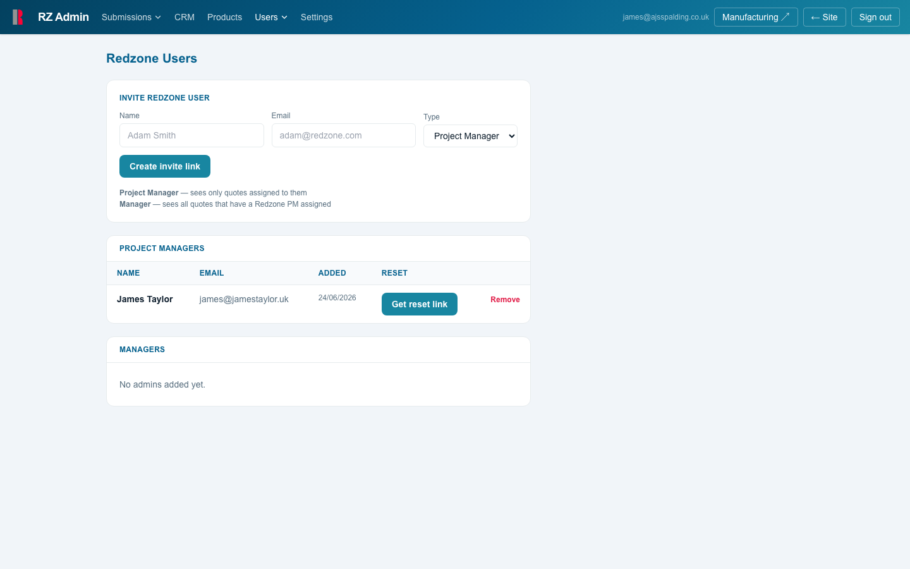

The Redzone portal is the external-facing view used by Redzone project managers and managers to track the orders they are involved with. This page manages who has access.

**Two types of Redzone user**

| Type | What they see |
|---|---|
| **Project Manager** | Only the orders specifically assigned to them |
| **Manager** | All orders that have any Redzone PM or Manager assigned |

**Inviting a Redzone user**

1. Enter their **Name** and **Email**.
2. Select **Project Manager** or **Manager** from the Type dropdown.
3. Click **Create invite link**.
4. Copy and send the one-time link to the person. They set their password and land on their Redzone dashboard.

Redzone users log in separately at: **https://redzone.ajsspalding.co.uk/redzone/login**

**Assigning a Redzone user to an order**

Go to the order detail page and use the **Redzone PM** card. See [section 3.5](#35-assigning-a-redzone-pm).

---

### 8.3 Resetting a Password

On either the **AJS Users** or **Redzone Users** page, click **Get reset link** next to the relevant user.

A secure one-time link is generated and copied to your clipboard instantly — no email is sent by the system. Paste the link to the user directly. When they open it they will be prompted to set a new password.

> Reset links expire after 24 hours. If the user does not use it in time, simply generate a new one.

---

## 9. Settings

**Settings** in the navigation

The settings page contains portal-wide configuration. Contact James Taylor before making changes here.

---

## 10. Email Flows — What Goes Out Automatically

Understanding when emails are triggered helps avoid duplicate communications or customer confusion.

### Emails sent to the customer

| Trigger | Email sent |
|---|---|
| Customer submits a quote | Quote confirmation with PDF attachment |
| Admin clicks **Resend email** on an order | Revised quote with updated PDF (revision number incremented) |
| Admin clicks **Save & notify customer** — Order confirmed | "Your order has been confirmed" |
| Admin clicks **Save & notify customer** — Invoiced | "Invoice issued for your order" |
| Admin clicks **Save & notify customer** — Payment received | "Payment received — thank you" |
| Admin clicks **Save & notify customer** — Ready to ship | "Your order is ready to despatch" |
| Admin clicks **Save & notify customer** — Shipped | "Your order has been shipped" (includes tracking if provided) |
| Admin clicks **Save & notify customer** — Complete | "Your order is complete" |
| Admin clicks **Save & notify customer** — Cancelled | "Order update" (includes reason if entered) |
| Customer requests an installation quote at checkout | Installation budget estimate with PDF |

### Emails sent to the Redzone PM (if assigned)

Every time a status update is saved, the assigned Redzone PM receives a **separate internal notification** — not a copy of the customer email. It contains:

- Customer name and company
- Site name
- Quote reference
- New status
- Tracking details (if shipped)

No pricing is included in PM notifications.

### Emails sent to AJS (accounts / internal)

- When a customer accepts a quote, an internal notification is sent to the accounts team for invoice preparation.

---

*Document produced by AJS Spalding Ltd — internal use only.*  
*Portal built and maintained by James Taylor.*
