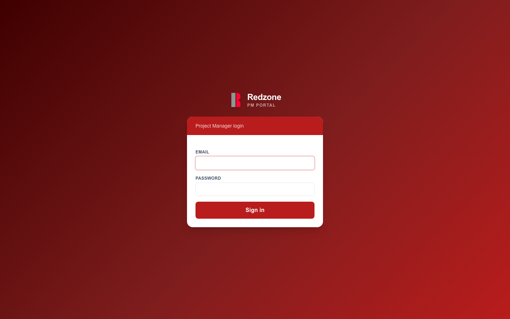
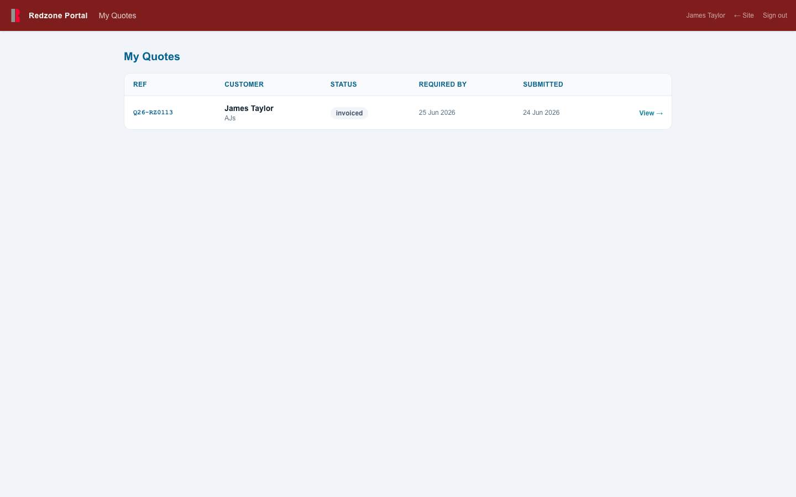
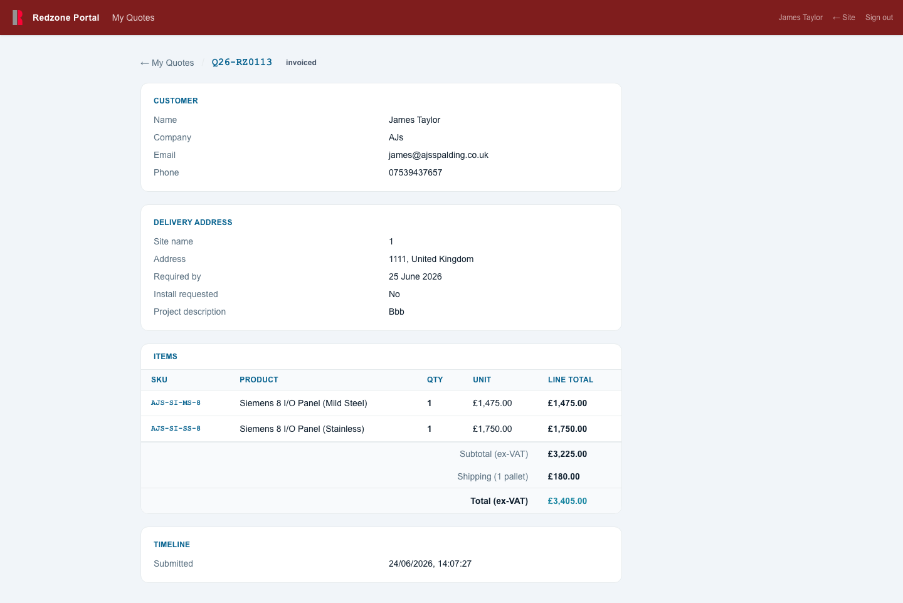

# AJS Redzone Portal — Redzone PM User Guide

**For:** Redzone project managers and managers  
**Portal:** https://redzone.ajsspalding.co.uk/redzone  
**Last updated:** June 2026

---

## Contents

1. [Logging In](#1-logging-in)
2. [Your Quotes List](#2-your-quotes-list)
3. [Quote Detail](#3-quote-detail)
4. [Status Notifications](#4-status-notifications)
5. [Access & Passwords](#5-access--passwords)

---

## 1. Logging In

Navigate to **https://redzone.ajsspalding.co.uk/redzone/login**

Enter your email address and password, then click **Sign in**.

> **Forgotten your password?** Contact your AJS account manager — they can generate a secure one-time reset link for you instantly. See [section 5](#5-access--passwords).

---

## 2. Your Quotes List

After logging in you land directly on your quotes list.

This shows every hardware quote from the AJS portal that you have been assigned to as project manager. Each row shows:

| Column | Description |
|---|---|
| **Ref** | The AJS quote reference (e.g. Q26-RZ0111) |
| **Customer** | Customer name and company |
| **Status** | Where this order is in the process — colour-coded |
| **Required by** | The date the customer needs delivery |
| **Submitted** | When the customer originally submitted the quote request |

**Status colours**

| Colour | Status |
|---|---|
| Yellow | Quote submitted |
| Blue | Order confirmed |
| Purple | In build |
| Teal | Ready to ship |
| Green | Shipped |
| Grey | Complete / Cancelled |

Click anywhere on a row (or **View →**) to open the full detail.

> **If your list is empty:** You have not yet been assigned to any quotes. Contact your AJS account manager.

> **Managers:** If your account has manager access, you will see all quotes that have any Redzone PM or Manager assigned — not just your own.

---

## 3. Quote Detail

Click any quote to open its full detail view.

The detail page shows everything relevant to you about this order. It is read-only — pricing and any admin notes are not shown.

### Tracking information

When an order has been shipped, a green **Tracking** panel appears at the top of the page showing the carrier reference and a direct link to track the shipment.

### Customer

| Field | |
|---|---|
| Name | Customer contact name |
| Company | Customer company |
| Email | Customer email address |
| Phone | Customer phone number |

### Delivery address

| Field | |
|---|---|
| Site name | Name of the installation site |
| Address | Full delivery address |
| Required by | Customer's requested delivery date |
| Install requested | Whether the customer has asked for an AJS installation quote |
| Project description | Free-text notes the customer provided at checkout |

### Items

The hardware items on the order — SKU, product name, quantity, unit price, and line total.

> Prices shown are in GBP ex-VAT, matching the quote sent to the customer.

### Timeline

Shows when the quote was submitted and (if applicable) when it was accepted by the customer.

---

## 4. Status Notifications

You do not need to log in to stay informed. Whenever AJS updates the status of an order you are assigned to, you receive an automatic email notification.

The notification tells you:

- Customer name and company
- Site name
- Quote reference
- New status
- Tracking carrier and link (if the order has been shipped)

These are internal notifications — the customer receives a separate email from AJS directly.

---

## 5. Access & Passwords

### Getting access

Access to the Redzone portal is set up by AJS. When your account is created you will receive a one-time invite link by email. Open the link and set your password — the link expires after 24 hours.

If your invite link has expired, ask your AJS contact to generate a new one.

### Resetting your password

Contact your AJS account manager. They can generate a secure one-time reset link immediately — no email is sent by the system, so they will send it to you directly. When you open the link you will be prompted to set a new password.

Reset links expire after 24 hours. If you do not use it in time, ask for a new one.

---

*Redzone portal built and maintained by AJS Spalding Ltd.*  
*Contact james@ajsspalding.co.uk for technical support.*
