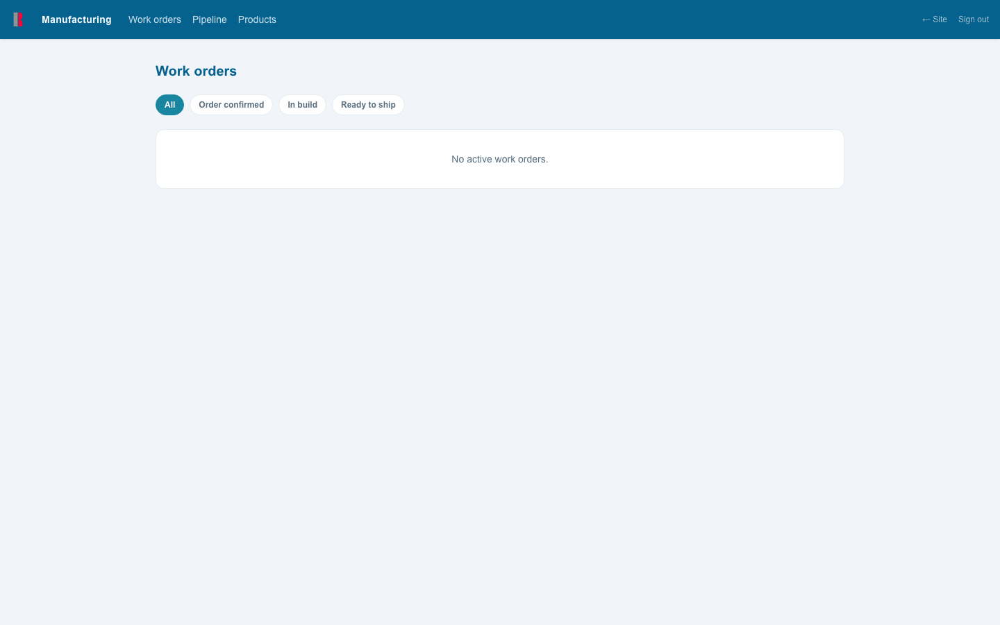
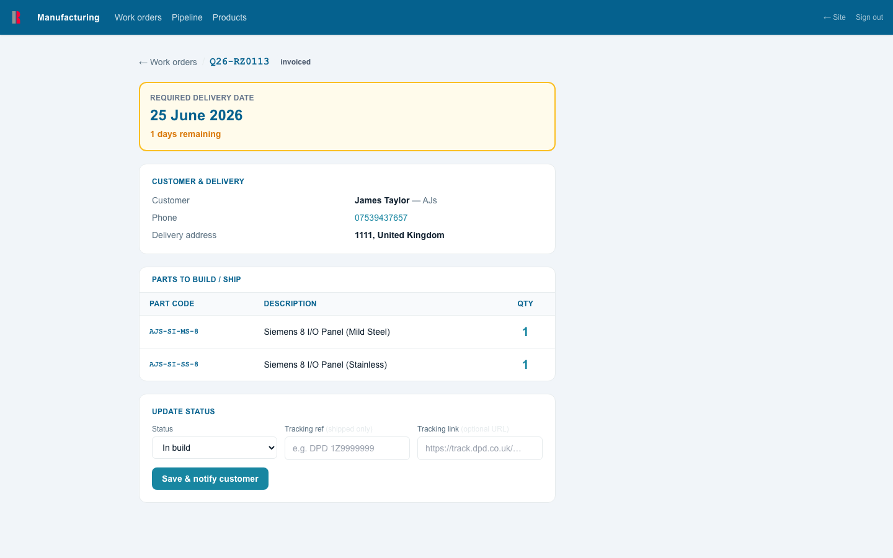
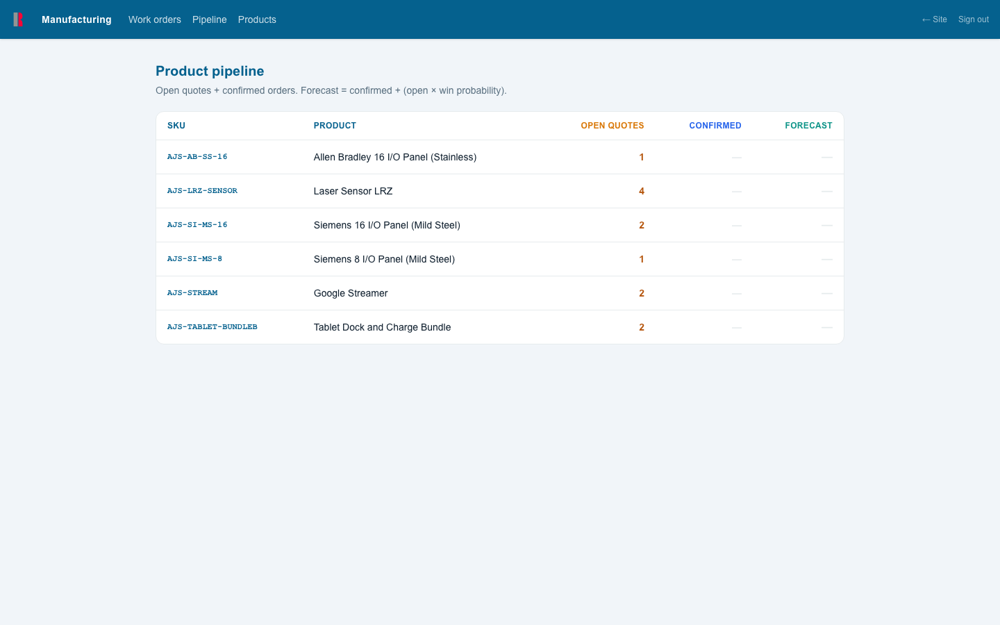
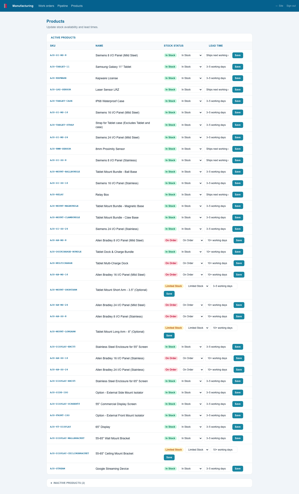

# AJS Manufacturing Portal — Workshop Guide

**For:** Workshop / manufacturing staff  
**Portal:** https://redzone.ajsspalding.co.uk/manufacturing  
**Last updated:** June 2026

---

## Contents

1. [Logging In](#1-logging-in)
2. [Navigation](#2-navigation)
3. [Work Orders](#3-work-orders)
   - 3.1 [Work Orders List](#31-work-orders-list)
   - 3.2 [Opening a Work Order](#32-opening-a-work-order)
   - 3.3 [Updating Status & Shipping](#33-updating-status--shipping)
4. [Pipeline](#4-pipeline)
5. [Products — Stock & Lead Times](#5-products--stock--lead-times)
6. [Access & Passwords](#6-access--passwords)

---

## 1. Logging In

Navigate to **https://redzone.ajsspalding.co.uk/manufacturing**

Enter your AJS email address and password, then click **Sign in**.

> **Forgotten your password?** Contact an admin user — they can generate a secure reset link for you. See [section 6](#6-access--passwords).

---

## 2. Navigation

The dark navigation bar runs across the top of every page:

| Nav item | What it opens |
|---|---|
| **Work orders** | The list of active orders to build and ship |
| **Pipeline** | Product demand summary across all open and confirmed orders |
| **Products** | Update stock availability and lead times |
| **← Site** | Returns to the customer-facing catalogue |
| **Sign out** | Logs you out |

---

## 3. Work Orders

### 3.1 Work Orders List



This is your main working view. It shows every confirmed order that is currently active — sorted by required delivery date, nearest first.

Only orders in these three stages appear here:

| Status | Meaning |
|---|---|
| **Order confirmed** | Customer has confirmed — ready to start building |
| **In build** | Currently being built and prepared |
| **Ready to ship** | Built, packed, and waiting for collection / despatch |

Completed, shipped, or cancelled orders do not appear in this list.

**Delivery date colours**

The required date on each card is colour-coded so you can see at a glance what needs attention:

| Colour | Meaning |
|---|---|
| Grey | Plenty of time |
| Amber / ⚡ | Due within the next 7 days |
| Red / ⚠ | Overdue |

**Filtering by status**

Use the filter buttons at the top (**Order confirmed**, **In build**, **Ready to ship**) to narrow the list. Click **All** to see everything.

---

### 3.2 Opening a Work Order

Click any card to open the full work order detail.



The detail page shows everything you need to build and ship the order:

**Required delivery date** — shown large at the top in a colour-coded panel (grey / amber / red depending on urgency).

**Customer & delivery**

| Field | |
|---|---|
| Customer | Name and company |
| Phone | Customer contact number (tap to call on mobile) |
| Delivery address | Where the order is being shipped to |
| Installation | Flagged in amber if the customer has requested an AJS installation — coordinate with the office |

**Parts to build / ship**

A table of every item on the order:

| Column | |
|---|---|
| Part code | AJS SKU / part number |
| Description | Product name |
| Qty | Quantity required — shown large for easy reading |

> **Note:** Prices are not shown in the workshop portal.

Use **← Work orders** in the top-left to return to the list.

---

### 3.3 Updating Status & Shipping

The **Update status** panel sits at the bottom of every work order detail page.

**Workflow**

```
Order confirmed → In build → Ready to ship → Shipped
```

1. Select the new status from the **Status** dropdown.
2. If marking as **Shipped** — enter the carrier tracking reference (e.g. `DPD 1Z9999999`) and optionally a tracking link URL.
3. Click **Save & notify customer**.

The customer receives an automated email immediately when the status is saved. The Redzone PM (if one is assigned) also receives a separate internal notification.

> **Shipped status:** Once you mark an order as Shipped and enter a tracking reference, the portal automatically moves the order to **Complete** after a short period. It will disappear from your work orders list.

> **Tracking link:** Paste the full URL from the carrier's website (e.g. `https://track.dpd.co.uk/...`). The customer can click it directly in their email.

---

## 4. Pipeline

**Pipeline** in the navigation



The pipeline gives a forward-looking view of demand across the product range — useful for planning stock and build schedules.

| Column | Meaning |
|---|---|
| **Open quotes** | Units on quotes that haven't been confirmed yet |
| **Confirmed** | Units on confirmed, live orders (in your work orders list) |
| **Forecast** | Confirmed + (open × win probability). This is the best estimate of total demand |

The pipeline is read-only — it updates automatically as new orders come in and statuses change.

---

## 5. Products — Stock & Lead Times

**Products** in the navigation



This page lets you update the stock status and lead time shown to customers on the product catalogue. Keep these accurate so customers get realistic expectations at the point of quoting.

**Updating a product**

For each active product, you can change:

| Field | Options / Notes |
|---|---|
| **Stock status** | In Stock / Limited Stock / On Order |
| **Lead time** | Free text — e.g. "3–5 days", "4–6 weeks" |

Change the values and click **Save** on that row. Changes take effect on the customer catalogue immediately.

**Stock status colours**

| Colour | Status |
|---|---|
| Green | In Stock |
| Amber | Limited Stock |
| Red | On Order |

Inactive products (hidden from customers) are shown collapsed at the bottom of the page — click to expand if you need to see them.

---

## 6. Access & Passwords

### Getting access

Access is set up by an AJS admin. When your account is created you will receive a one-time invite link. Open the link and set your password — the link expires in 24 hours. If it has expired, ask an admin to generate a new one.

### Resetting your password

Contact an AJS admin. They can generate a secure one-time reset link immediately — no email is sent by the system, so they will send it to you directly. When you open the link you will be prompted to set a new password. Reset links expire after 24 hours.

---

*Portal built and maintained by AJS Spalding Ltd.*  
*Contact james@ajsspalding.co.uk for technical support.*
